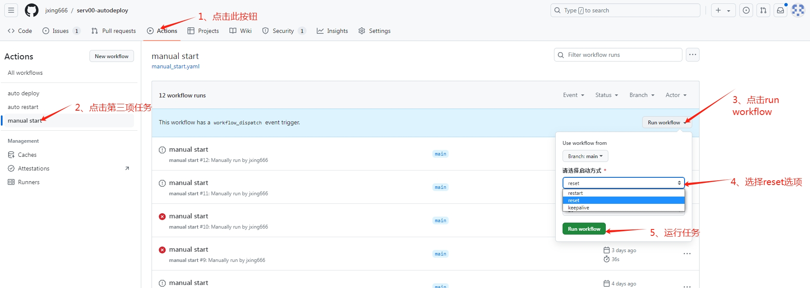

# Serv00与CT8自动化部署启动，保号续期保活，节点被删自动重新部署，发送节点消息到Telegram

## 利用github Action以及python脚本实现，支持多个账号批量部署，CF CDN自动配置

## 🙏🙏🙏点个Star！！Star！！Star！！

###  将代码fork到你的仓库并运行的操作步骤

## (一). Fork 仓库

```
1、访问原始仓库页面： 打开你想要 fork 的 GitHub 仓库页面。
2、Fork 仓库 点击页面右上角的 "Fork" 按钮，将仓库 fork 到你的 GitHub 账户下。
3、若没有Serv00服务器 请参照(六)服务器Serv00免费申请教程,从教程【搭建vless节点】步骤开始就可使用本项目进行自动化部署：
   包括自动申请随机端口、自动化配置服务器运行环境、自建节点启动，节点保活节点下线自动重启，支持node和PM2两种启动方式
```

## (二). 设置 Telegram token

```
1、创建 Telegram Bot 【非必须】，如果没有配置此项 tg无法收到节点信息
    在 Telegram 中找到 @BotFather，创建一个新 Bot，并获取 API Token。 
    获取到你的 Chat ID 方法一，在一休技术交流群里发送/id@KinhRoBot获取，返回用户信息中的ID就是Chat ID
    获取到你的 Chat ID 方法二，可以通过向 Bot 发送一条消息，然后访问 https://api.telegram.org/bot<your_bot_token>/getUpdates 找到 Chat ID
```

## (三). 配置 GitHub Secrets

**1、Setting->Secrets->actions 添加secrets名称：ENV_CONFIG**<br>
(注：此项可直接复制下面的内容配置即可)

```json
{
  "env_config": {
    "reset": 1,
    "outo_npm_install": 1,
    "code_source_url": "git clone http://github.com/zjxde/serv00-ws",
    "kill_pid_path": "serv00",
    "nodejs_name": "index"
  }
}
```

**2、Setting->Secrets->actions 添加secrets名称：USER_INFO**
检验配置内容是否json格式有效地址：https://www.bejson.com/explore/index_new/

```
(注：此项参数中括号只是配置说明，需要修改成你自己的) 
配置格式为json格式：{"tg_config"{你的配置},accounts:[{账号一配置},{账号二配置},......]}
```

```json
{
  "tg_config": {
    "tg_bot_token": "tg token",
    "tg_chat_id": "tg chat id",
    "send_tg": 1,
    "node_num": 2,
    "usepm2": 0,
    "cf_token": "xxx",
    "cf_username": "xxx"
    
  },
  "accounts": [
    {
      "username": "【用户名】",
      "password": "【密码】",
      "domain": "【域名】",
      "pannelnum": 6,
      "cmd":"python reset 20",
      "server_type": 1,
      "use_cf": 1,
      "ssl_domains": "xxx.username.us.kg,xxx2.username.us.kg"
    },
    {
      "username": "【用户名】",
      "password": "【密码】",
      "domain": "【域名】",
      "pannelnum": 6,
      "cmd":"python reset 20",
      "server_type": 1,
      "use_cf": 0
    }
  ]
}

```

**3、Setting->Secrets->actions 添加secrets名称：ENV_CMD,值复制下面内容**

```
py restart 30
```

**4、ENV_CONFIG 配置项参数说明**

|参数名称|参数说明|
|--|--|
|port|节点端口号|
|reset|是否需要重装节点 0：不重装 1：重装|
|outo_npm_install|是否自动安装 0：手动安装 1 : 自动安装 此项默认即可|
|code_source_url|节点代码地址 默认即可|
|kill_pid_path|默认即可|
|nodejs_name|节点布置文件node.js的名称 默认即可|
|uuid|节点uuid值，可以不修改|

**3、USER_INFO 配置项参数说明**

|参数名称| 参数说明                                                                                                                             |
|--|----------------------------------------------------------------------------------------------------------------------------------|
|tg_chat_id| Chat ID  当send_tg=0此项默认即可                                                                                                        |
|send_tg| 是否需要发送节点信息到telegram ,1:开启 0：不开启                                                                                                  |
|node_num| 开启节点个数，由于节点serv00端口限制，最多可设3个，默认2个                                                                                                |
|usepm2| 是否开启pm2 1:开启 0：不开启 ,默认不开启, 比较耗资源建议不开启                                                                                            |
|username| **用户名**                                                                                                                          |
|password| **密码**                                                                                                                           |
|domain| **你申请的域名，如CF绑定的域名,或serv00默认域名**                                                                                                  |
|pannelnum| 你申请机器号,如panel6.serv00.com就设置为6, CT8此项默认即可                                                                                        |
|server_type| 服务器类型 1: Serv00  2: CT8  ，默认为1                                                                                                   |
|cmd| **reset:重新安装节点 ,keepalive:保活 ,restart:只重启 ,三种模式后面参数都可跟保活间隔时间 ,单位为分钟 如： python restart 20 ,就表示重启并保活 时间设置为20分钟，若不加时间参数，则不会进行节点保活** |
|basepath| 节点部署目录：默认 /home/XXX[用户名]/domains/XXX[域名]/app2/serv00-ws/                                                                         |
|tg_bot_token| 申请tg机器人的token                                                                                                                    |
|cf_username| cloudflare 用户名 当use_cf=0 此项默认即可                                                                                                  |
|cf_token| cloudflare API 密钥 （**Global API Key**） https://dash.cloudflare.com/profile/api-tokens ，当use_cf=0此项默认即可                           |
|use_cf| 是否开启CF CDN 1：开启 0：不开启                                                                                                            |
|ssl_domains| 当use_cf =1时 此项必填，CF CDN记录配置域名如：test.junx066.us.kg 多个域名以英文逗号隔开                                                                    |
## (四). 启动 GitHub Actions

```
1、配置 GitHub Actions
    》在你的 fork 仓库中，进入 Actions 页面。
    》如果 Actions 没有自动启用，点击 Enable GitHub Actions 按钮以激活它。
2、运行工作流 
    》GitHub Actions 将会根据你设置自动运行脚本。
    》如果需要手动触发，可以在 Actions 页面手动运行工作流。
3、工作流文件有 
    auto_deploy.yaml:一开始部署使用此任务
    auto_restart.yaml : 可自定义命令重启服务器 注使用该使用需要手动配置 secrets 名称为 ENV_CMD，值为 py restart 10【推荐】 ，后面
    的数值可按自己需求自行修改( 参数说明：reset:重新初始化环境 keepalive:保活 restart:只重启 三种模式后面参数都可跟保活间隔时间，单位为分钟)
```

### 操作步骤说明



<br/>

## (五).注意事项

```
1、保密性: Secrets 是敏感信息，请确保不要将它们泄露到公共代码库或未授权的人员。
2、更新和删除: 如果需要更新或删除 Secrets，可以通过仓库的 Secrets 页面进行管理。
3、通过以上步骤，你就可以成功将代码 fork 到你的仓库下并运行了。如果需要进一步的帮助或有其他问题，请随时告知！
```

## (六).相关教程

1、[服务器Serv00免费申请教程](https://blog.yixiu.us.kg/posts/gratis/freevpsandvless/)
2、[Serv00与ct8自动化批量保号](https://github.com/yixiu001/serv00-login)
3、[TG技术交流群](https://t.me/yxjsjl)
4、[校验json地址](https://www.bejson.com/explore/index_new/)
